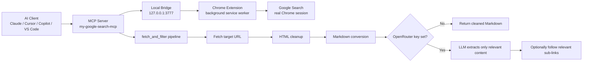

# My Google Search MCP

<div align="center">

**Real Google search for AI agents, powered by your own Chrome session**

[](https://www.npmjs.com/package/my-google-search-mcp)
[](LICENSE)
[](https://modelcontextprotocol.io)

</div>

---

## Overview

`my-google-search-mcp` is a Model Context Protocol server that gives AI clients direct access to:

- `google_search` for real Google results through your actual Chrome browser
- `fetch_and_filter` for extracting only the useful parts of any web page

This avoids the usual Google scraping problems. Instead of pretending to be a browser, this project uses your real browser with a lightweight Chrome extension.

## Why it stands out

| Feature | What you get |
|---|---|
| Real browser search | Queries run through your actual Chrome session |
| Cleaner agent context | Results come back as readable Markdown |
| Smarter page extraction | Optional LLM filtering removes page bloat |
| Easy client setup | Works with MCP-compatible apps and editors |
| Local-first bridge | Extension talks to a loopback server on `127.0.0.1` |

## How it works

```text
AI Client
  -> MCP over stdio
  -> my-google-search-mcp
  -> local bridge on 127.0.0.1:3777
  -> Chrome extension
  -> Google Search in your real Chrome browser
```

For page extraction:

```text
URL -> fetch() -> HTML cleanup -> Markdown conversion -> optional LLM filtering
```

### Architecture diagram



## Tools

### `google_search`

Searches Google and returns structured Markdown that may include:

- AI Overview
- Featured Snippet
- Knowledge Panel
- Top organic results
- People Also Ask

Requirement: Chrome must be open and the bundled extension must be installed.

### `fetch_and_filter`

Fetches a URL and returns only the content relevant to the request.

Without `OPENROUTER_API_KEY`:
- Returns cleaned Markdown from the page

With `OPENROUTER_API_KEY`:
- Uses an LLM to extract only the parts that match the query
- Follows the most relevant sub-links if the root page does not contain the answer

## Quick Start

To use `google_search`, two things are required:

1. The Chrome extension must be installed in Chrome
2. The MCP server must be added to your MCP client config

Once both are set up and the bridge token matches, it works.

## Requirements

- Node.js and npm installed
- Google Chrome installed
- An MCP-compatible client such as Claude Desktop, Cursor, VS Code, or Copilot
- The bundled Chrome extension loaded from `chrome-extension/`
- MCP client configured to run `my-google-search-mcp`

Optional:

- `OPENROUTER_API_KEY` if you want `fetch_and_filter` to return tightly filtered results instead of cleaned full-page Markdown

### 1. Install the Chrome extension

1. Clone or download this repo
2. Open `chrome://extensions`
3. Turn on **Developer mode**
4. Click **Load unpacked**
5. Select the `chrome-extension/` folder

### 2. Run the MCP server

```bash
npx my-google-search-mcp
```

You do not need to install the npm package first. `npx` will download and run it for the user.

On first run, the CLI:

- starts the local MCP server
- starts the local bridge on `127.0.0.1:3777`
- generates a bridge token and stores it in:

```text
~/.mcp-google-search.json
```

- prints the exact token you should place into the extension

Important:

- `npx my-google-search-mcp` runs the server
- the Chrome extension must still be installed once for `google_search` to work
- the extension token and server token must match

### 3. Set the token in the extension

Open `chrome-extension/background.js` and update:

```js
const BRIDGE_TOKEN = "your-token-here";
```

Then reload the extension from `chrome://extensions`.

### 4. Connect it to your MCP client

Example config:

```json
{
  "mcpServers": {
    "my-google-search-mcp": {
      "command": "npx",
      "args": ["-y", "my-google-search-mcp"]
    }
  }
}
```

Once this config is added, the MCP client will launch `npx -y my-google-search-mcp` for the user automatically. They do not need a separate global install.

### 5. Start using it

After the extension is installed and the MCP config is added:

- restart your MCP client if needed
- make sure Chrome is open
- use `google_search` from your AI client

That is the full setup.

## Client Examples

### Claude Desktop

Add this server to your MCP config:

```json
{
  "mcpServers": {
    "my-google-search-mcp": {
      "command": "npx",
      "args": ["-y", "my-google-search-mcp"]
    }
  }
}
```

### VS Code / Copilot / Cursor

Use the same command and args in your MCP server configuration:

```json
{
  "mcpServers": {
    "my-google-search-mcp": {
      "command": "npx",
      "args": ["-y", "my-google-search-mcp"]
    }
  }
}
```

### With environment variables

```json
{
  "mcpServers": {
    "my-google-search-mcp": {
      "command": "npx",
      "args": ["-y", "my-google-search-mcp"],
      "env": {
        "BRIDGE_TOKEN": "your-secret-token",
        "OPENROUTER_API_KEY": "sk-or-v1-..."
      }
    }
  }
}
```

## Environment Variables

Copy `.env.example` or provide env vars through your MCP client:

```env
OPENROUTER_API_KEY=sk-or-v1-...
OPENROUTER_MODEL=google/gemini-2.0-flash-001
BRIDGE_TOKEN=your-secret-token
```

## Local Development

```bash
git clone https://github.com/your-username/my-google-search-mcp
cd my-google-search-mcp
npm install
npm run build
npm start
```

For development mode:

```bash
npm run dev
```

## Security Notes

- Bridge requests require a shared token
- Bridge only listens on `127.0.0.1`
- Search requests are rate-limited
- `fetch_and_filter` blocks localhost and private/internal IP ranges
- Prompt injection is treated as untrusted page content during LLM extraction
- Error messages are sanitized before being returned to clients

## Troubleshooting

### Extension not connected

- Make sure Chrome is open
- Make sure the extension is loaded
- Make sure the token in `background.js` matches the server token

### `fetch_and_filter` returns full page content

That means `OPENROUTER_API_KEY` is not set. The tool still works, but it skips LLM filtering.

### Google results stop parsing correctly

Google changes its DOM often. If that happens, update the selectors in `chrome-extension/background.js`.

## Repo Structure

```text
src/
  bin.ts              CLI entrypoint
  index.ts            MCP server and tool registration
  bridge.ts           local bridge between MCP server and Chrome extension
  fetcher.ts          HTML fetching, cleanup, and Markdown conversion
  llm.ts              OpenRouter integration
  site-search.ts      query-driven extraction and link-following

chrome-extension/
  background.js       Chrome extension service worker
  manifest.json       extension manifest
```

## Publishing Notes

This repo is ready for public use as a package-style MCP server:

- npm package name: `my-google-search-mcp`
- binary entrypoint: `my-google-search-mcp`
- license: MIT

## License

MIT
